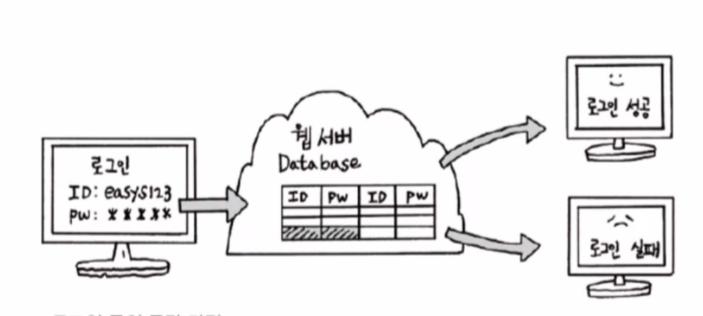
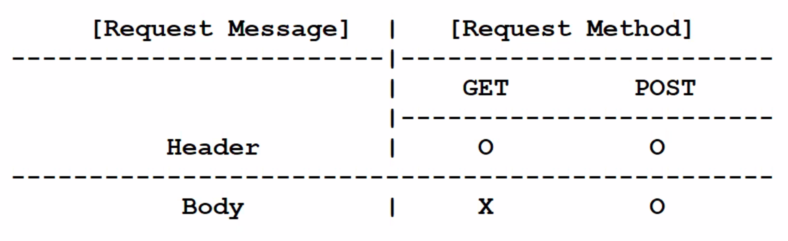

<aside>
🌐 로그인 폼의 동작 과정:

1. 사용자가 로그인 폼에 아이디와 비밀번호를 입력합니다.
2. 사용자가 제출을 클릭하면, `<form>` 태그의 `action` 속성에 지정된 URL로 요청이 전송됩니다.
3. 서버는 요청을 받고, 입력된 아이디와 비밀번호를 확인합니다.
4. 유효한 아이디와 비밀번호인 경우, 서버는 사용자에게 로그인 성공 페이지를 보여줍니다.
5. 그렇지 않은 경우, 서버는 사용자에게요 로그인 실패 페이지를 보여줍니다.

</aside>

## form태그

`<form>` 태그는 사용자로부터 정보를 입력받을 때 사용합니다. 다음과 같은 속성을 포함합니다.

    - `action`: 폼 데이터를 보낼 서버의 URL을 지정합니다.
    - ⭐️ `method`: 폼 데이터를 서버에 보낼 HTTP 메서드를 지정합니다. 이 값을 변경하면 폼 데이터를 전송하는 방식이 달라집니다.
      보통 `get` 방식은 폼 데이터를 URL 끝에 쿼리 문자열로 전송하고, `post` 방식은 폼 데이터를 HTTP 요청 본문에 담아 전송합니다. 이 값이 지정되어 있지 않으면 `get` 방식으로
      전송됩니다.
    - `enctype`: 폼 데이터를 서버로 보낼 때 사용할 인코딩 방식을 지정합니다.
    - `target`: 폼 데이터를 보낸 후 결과를 표시할 창의 이름을 지정합니다.
    - `name`: 폼의 이름을 지정합니다.

`<form>` 태그는 다음과 같은 입력 요소들을 포함할 수 있습니다.

    - `<input>`: 텍스트, 숫자, 이메일 등 다양한 종류의 입력 요소를 생성합니다.
    - `<textarea>`: 여러 줄의 텍스트를 입력할 수 있는 입력 요소를 생성합니다.
    - `<select>`: 드롭다운 목록을 생성합니다.
    - `<button>`: 버튼을 생성합니다.
    - `<label>`: 레이블을 생성합니다.

`<form>` 태그는 다음과 같이 사용합니다.

    ```html
    <form action="<https://example.com>" method="post">
      <label for="name">이름:</label>
      <input type="text" id="name" name="name">
    
      <label for="email">이메일:</label>
      <input type="email" id="email" name="email">
    
      <button type="submit">제출</button>
    </form>
    ```

위 코드는 이름과 이메일을 입력받는 폼을 생성하며, 데이터를 서버로 보내는 버튼이 있습니다. `action` 속성에는 데이터를 보낼 서버의 URL을, `method` 속성에는 HTTP 메서드를
지정합니다. `input` 태그의 `type` 속성은 입력 요소의 종류를 지정합니다. 나머지 속성은 각각 입력 요소의 이름과 ID를 지정합니다.

`<form>` 태그 안에 여러 개의 입력 요소를 포함할 수 있으며, 이들은 모두 같은 서버로 데이터를 보냅니다.

`<fieldset>` 태그는 폼 안에 여러 개의 관련된 입력 요소를 그룹화할 때 사용합니다. `<legend>` 태그는 이 그룹의 제목을 지정합니다.

    <aside>
    🌐 `method` 속성은 HTML 폼 데이터를 서버로 전송하는 HTTP 메서드를 지정합니다. 보통 `get`과 `post` 메서드가 사용됩니다.

    - `get`: 폼 데이터를 URL 끝에 쿼리 문자열의 형태로 전송합니다. 브라우저는 URL을 조합하여 요청을 보냅니다.
        - 폼 데이터가 URL에 노출되므로 보안에 취약합니다.
        - URL에 전송할 수 있는 최대 데이터 크기가 있습니다.
        - 브라우저의 뒤로 가기 버튼을 사용하여 이전에 전송된 데이터를 다시 얻을 수 있습니다.
    - `post`: 폼 데이터를 HTTP 요청 본문에 담아 전송합니다. 브라우저는 본문을 생성하여 요청을 보냅니다.
        - URL에 데이터가 노출되지 않으므로 보안에 강합니다.
        - 전송할 수 있는 데이터 크기에 제한이 없습니다.
        - 브라우저의 뒤로 가기 버튼을 사용하여 이전에 전송된 데이터를 얻을 수 없습니다.

이러한 차이점 때문에, 보안이 중요한 데이터를 보낼 때는 `post` 메서드를 사용하는 것이 좋습니다. 그러나 간단한 데이터를 보낼 때는 `get` 메서드를 사용하는 것이 더 간편합니다.

    

    </aside>

    ```html
    <form>
      <fieldset>
        <legend>개인 정보</legend>
    
        <label for="name">이름:</label>
        <input type="text" id="name" name="name">
    
        <label for="email">이메일:</label>
        <input type="email" id="email" name="email">
      </fieldset>
    
      <fieldset>
        <legend>배송 정보</legend>
    
        <label for="address">주소:</label>
        <input type="text" id="address" name="address">
    
        <label for="zip">우편번호:</label>
        <input type="text" id="zip" name="zip">
      </fieldset>
    </form>
    ```

위 코드는 폼 안에 개인 정보와 배송 정보를 입력받는 두 개의 그룹을 생성합니다. `fieldset` 태그 안에는 각 그룹의 입력 요소들이 포함되어 있으며, `legend` 태그는 그룹의 제목을 지정합니다.

## input 태그

`<input>` 태그는 사용자로부터 입력을 받을 때 사용합니다. 다음과 같은 속성을 포함합니다.

    - `type`: 입력 요소의 종류를 지정합니다. 텍스트, 숫자, 이메일, 파일 등 다양한 종류의 입력 요소를 만들 수 있습니다.
    - `name`: 입력 요소의 이름을 지정합니다. 이 이름은 서버에서 폼 데이터를 처리할 때 사용됩니다.
    - `value`: 입력 요소의 초기값을 지정합니다. JavaScript에서는 사용자가 입력한 값을 `value`로 인식하기도 합니다.
    - `placeholder`: 입력 요소에 입력할 값의 예시를 표시합니다.
    - `required`: 입력 요소가 반드시 입력되어야 하는지를 지정합니다.
    - `disabled`: 입력 요소가 비활성화되어 있는지를 지정합니다.
    - `readonly`: 입력 요소가 읽기 전용인지를 지정합니다.
    - `min`, `max`: 입력 요소의 최솟값과 최댓값을 지정합니다. `type` 속성이 `date`, `number`, `range`일 때 사용됩니다.
    - `step`: 입력 요소의 증감 단위를 지정합니다. `type` 속성이 `number`, `range`일 때 사용됩니다.
    - `autofocus`: 페이지가 로드될 때 자동으로 입력 요소에 포커스를 설정합니다.
    - `autocomplete`: 입력 요소에 자동완성 기능을 적용합니다.

`<input>` 태그는 다음과 같은 종류의 입력 요소를 만들 수 있습니다.

    - `text`: 일반적인 텍스트 입력 요소를 만듭니다.
    - `password`: 비밀번호 입력 요소를 만듭니다.
    - `email`: 이메일 주소 입력 요소를 만듭니다.
    - `tel`: 전화번호 입력 요소를 만듭니다.
    - `number`: 숫자 입력 요소를 만듭니다.
    - `range`: 범위를 나타내는 입력 요소를 만듭니다.
    - `date`: 날짜 입력 요소를 만듭니다.
    - `time`: 시간 입력 요소를 만듭니다.
    - `datetime-local`: 로컬 시간과 날짜를 나타내는 입력 요소를 만듭니다.
    - `color`: 색상을 나타내는 입력 요소를 만듭니다.
    - `file`: 파일 업로드 요소를 만듭니다. 요청 방식은 `post` 이어야 하며, `enctype` 속성은 `multipart/form-data` 이어야 합니다.
    - `submit`: 폼 데이터를 서버로 제출하는 버튼을 만듭니다.
    - `reset`: 입력 요소의 값을 초기화하는 버튼을 만듭니다.
    - `button`: 아무 동작도 수행하지 않는 버튼을 만듭니다.
    - ⭐️ hidden

      HTML에서는 `input` 태그를 사용하여 숨겨진 버튼을 만들 수 있습니다. 이 버튼은 사용자에게 표시되지 않지만, JavaScript 코드에서 클릭 이벤트를 발생시키거나 폼을 제출할 때 사용됩니다.

        ```html
        <input type="hidden" id="myButton" value="Click me!">
        ```

      위 코드는 숨겨진 버튼을 생성합니다. `type` 속성이 `hidden`으로 설정되어 있으므로, 이 버튼은 사용자에게 표시되지 않습니다. 버튼의 `id` 속성은 자바스크립트에서 이 버튼을 참조할 때
      사용됩니다. `value` 속성은 버튼에 표시될 텍스트를 지정합니다.

      자바스크립트에서 숨겨진 버튼을 클릭하려면, 다음과 같이 `click` 메서드를 호출합니다.

        ```jsx
        document.getElementById('myButton').click();
        ```

      숨겨진 버튼을 사용하여 폼을 제출하려면, 다음과 같이 `submit` 메서드를 호출합니다.

        ```jsx
        document.getElementById('myForm').submit();
        ```

      위 코드는 `myForm`이라는 이름을 가진 폼을 제출합니다. 이 폼은 다음과 같이 생성됩니다.

        ```html
        <form id="myForm" action="/submit" method="post">
          <input type="hidden" name="username" value="johndoe">
          <input type="hidden" name="password" value="secret">
        </form>
        ```

      위 코드는 숨겨진 입력 요소를 사용하여 사용자의 이름과 비밀번호를 서버로 전송합니다. `type` 속성이 `hidden`으로 설정되어 있으므로, 이 요소들은 사용자에게 표시되지 않습니다.
      폼의 `action` 속성은 폼 데이터를 보낼 서버의 URL을, `method` 속성은 HTTP 메서드를 지정합니다. `name` 속성은 입력 요소의 이름을 지정하며, 이 이름은 서버에서 폼 데이터를
      처리할 때 사용됩니다. `value` 속성은 입력 요소의 초기값을 지정합니다.

    체크박스는 사용자가 여러 개의 옵션 중에서 선택할 수 있도록 하는 입력 요소입니다. 다음과 같은 속성을 포함합니다.
    
    - `name`: 체크박스의 이름을 지정합니다. 이 이름은 서버에서 폼 데이터를 처리할 때 사용됩니다.
    - `value`: 체크박스의 값을 지정합니다.
    - `checked`: 체크박스가 선택된 상태인지 여부를 지정합니다.
    
    ```html
    <input type="checkbox" name="fruits" value="apple" checked>
    <label for="apple">사과</label>
    
    <input type="checkbox" name="fruits" value="orange">
    <label for="orange">오렌지</label>
    ```
    
    위 코드는 체크박스로 "사과"와 "오렌지"를 표시하는 예시입니다. `name` 속성으로 같은 이름을 지정한 두 개의 체크박스는 함께 그룹핑됩니다. `value` 속성은 체크박스가 선택됐을 때 서버에 전송될 값을 지정합니다. `checked` 속성은 초기에 체크박스가 선택된 상태로 표시됩니다.
    
    `<input>` 태그는 다음과 같이 사용합니다.
    
    ```html
    <label for="name">이름:</label>
    <input type="text" id="name" name="name">
    
    <label for="email">이메일:</label>
    <input type="email" id="email" name="email">
    ```
    
    위 코드는 이름과 이메일을 입력받는 폼을 만드는 예시입니다. `type` 속성을 이용하여 텍스트 입력 요소와 이메일 입력 요소를 만들었습니다. 나머지 속성은 각각 입력 요소의 이름과 ID를 지정합니다.
    
    ```html
    <form action="memberLogin.jsp">
        <fieldset>
            <legend>Login1</legend>
            <label for="id">ID : </label> <input type="text" id="id" size="20">
            <label for="password">P/W : </label> <input type="password" id="password" size="20">
            <input type="submit" value="로그인">
        </fieldset>
    
    	  <fieldset>
            <legend>Login2</legend>
            <label for="id">ID : </label> <input type="text" name="id" id="id" size="20">
            <label for="password">P/W : </label> <input type="password" name="password" id="password" size="20">
            <input type="submit" value="로그인">
        </fieldset>
    </form>
    ```
    
    login1의 입력 양식에는 `name` 속성이 없어서 요청에 포함될 수 없습니다. 따라서 아래 login2 입력 양식과 같이 `name` 속성을 추가해야 합니다.
    
    두 번째로, 현재 폼에서는 사용자 입력 내용을 서버로 전달할 때 주소 표시줄에 전부 노출됩니다. 따라서 `method` 속성을 `post`로 입력해야 합니다.
    
    <aside>
    🌐 파일 업로드를 위해서는 `form` 태그에서 `method`와 `enctype` 속성을 `multipart/form-data`로 설정해야 합니다.
    
    ```html
    <form method="post" enctype="multipart/form-data">
        <fieldset>
          <legend>반품 정보</legend>
          <p>만일 수령한 상품에 문제가 있다면 즉시 <b>반품 신청</b>해 주세요.</p>
          <p>반품 신청시 상품의 상태를 사진으로 첨부해 주세요.</p>
          <hr>
          <input type="file">    
        </fieldset>
        <div>
          <input type="submit" value="반품 신청"> 
          <input type="reset" value="취소하기">
        </div>        
      </form>
    ```
    
    </aside>

## ISO-8859-1

ISO-8859-1은 라틴 알파벳을 사용하는 언어들을 위해 만들어진 문자 인코딩 방식 중 하나입니다. 이 문자 인코딩 방식은 1바이트로 문자를 표현하기 때문에, 다른 인코딩 방식에 비해 상대적으로 작은 용량으로
데이터를 전송할 수 있습니다.

ISO-8859-1은 라틴 알파벳을 포함한 총 191개의 문자를 인코딩할 수 있습니다. 이 문자 인코딩 방식은 HTML에서 특수문자를 나타낼 때도 사용됩니다. 예를 들어, <는 "<" 기호를 나타내고,
&는 "&" 기호를 나타냅니다.

ISO-8859-1은 기본적으로 유럽 언어들과 아이슬란드어, 타갈로그어 등에서 사용됩니다. 그러나, 이 문자 인코딩 방식은 한글, 중국어, 일본어 등을 포함한 다른 언어들의 문자를 인코딩하는 데에는 적합하지
않습니다.

## URL이란?

URL은 Uniform Resource Locator의 약자로 인터넷 상의 서버와 클라이언트 간 통신에서 자원의 위치를 나타내는 주소입니다. 일반적으로는 "http://"나 "https://"와 같은 프로토콜
식별자와 도메인 이름, 그리고 자원의 경로로 이루어져 있습니다.

Protocol + Host(Host Name + Port)

## login.html에 jsp파일로 연결해보기 코드

    ```html
    <%@ page contentType="text/html; charset=UTF-8" %>
    
    <%
    	final String ID = "longlee";
    	final String PASSWD = "6789"; 
    	String user_id = "";
    	String user_pw = "";
    	boolean result = false;
    	
    	if(request.getMethod().equals("POST")) {
    		user_id = request.getParameter("user_id");
    		user_pw = request.getParameter("user_pw");
    	}
    	
    	if(user_id != null && user_id.equals(ID) && user_pw != null && user_pw.equals(PASSWD)) {
    		result = true;
    	}
    %>
    
    <!DOCTYPE html>
    
    <html>
    <head>
    	<meta charset="UTF-8">
    	<title>memberLogin.jsp</title>
    </head>
    <body>
    
    	<h1>로그인 결과</h1>
    	<hr />
    
    <%
    	if(result) {
    %>
    	<h4><%= user_id %>님 로그인에 성공하셨습니다.</h4>
    <%		
    	}
    	else {
    %>
    	<h4>로그인에 실패하였습니다 ... <a href="login.html">재로그인</a></h4>
    <%
    	}
    %>
    
    </body>
    </html>
    ```