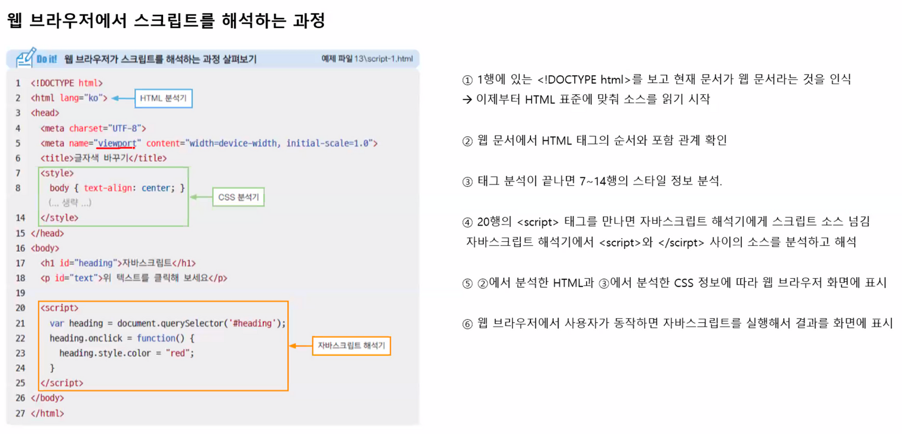

## 자바스크립트(JavaScript)

### 웹의 요소를 제어합니다.

- 웹 요소를 가져와서 필요에 따라 스타일을 변경하거나 움직이게 할 수 있습니다.
- 웹 사이트 UI 부분에 많이 활용합니다. (ex. 마우스 포인터를 올렸을 때 펼쳐지는 메뉴, 한 화면에서 탭을 눌러 내용만 바뀌도록 하는 콘텐츠 등)

### 웹 어플리케이션을 만듭니다.

- 최근의 웹 사이트는 사용자와 실시간으로 정보를 주고 받으며 애플리케이션처럼 동작합니다.
- (ex. 온라인 지도의 길찾기 서비스, 데이터 시각화 서비스, 공개된 API를 활용한 다양한 서비스)

### 다양한 라이브러리를 사용할 수 있습니다.

- 웹을 중심으로 하는 서비스가 늘어나면서 브라우저에서 처리해야 할 일이 늘어납니다. (라이브러리와 프레임워크가 계속 등장)
- (ex. 시각화를 위한 d3.js, 머신러닝을 위한 tensorflow.js, DOM 조작을 위한 jQuery 등)
- (ex2. 웹 애플리케이션 개발을 위한 React, Angular, Vue 등)

### 서버를 구성하고 서버용 프로그램을 만들 수 있습니다.

- Node.js : 프런트엔드 개발에 사용하던 자바스크립트를 백엔드 개발에서 사용할 수 있게 만든 프레임 워크
- 자바스크립트는 동적 타입 언어입니다.
- ECMA 스크립트5 = es5 → 현재는 es7 까지 시중에 나와있습니다.

## 웹 브라우저가 자바스크립트를 만났을 때



🌐 웹킷(Webkit) 엔진은 오픈소스로 개발된 웹 브라우저 엔진 중 하나로, 크롬, 사파리 브라우저 등에서 사용됩니다. CSS, HTML, JavaScript 코드를 해석하고 렌더링하여 웹 페이지를 사용자에게 보여주는 역할을 합니다. 웹킷 엔진은 브라우저 제작사에게 자유로운 커스터마이징이 가능하며, 안정성과 빠른 속도로 유명합니다.

🌐 자바스크립트는 동적 언어이므로 변수의 사용 범위에 제한이 없습니다. 이는 변수를 선언할 때 해당 변수가 전역 변수로 선언되었는지, 지역 변수로 선언되었는지에 대한 구분이 없다는 것을 의미합니다. 따라서, 함수 내에서 선언된 변수는 함수 내에서만 유효하며, 함수 밖에서 선언된 변수는 전역 변수로서 어디에서나 사용할 수 있습니다. 이는 자바스크립트에서 코드를 작성할 때 유용한 기능 중 하나이지만, 변수의 사용 범위를 제한하지 않기 때문에 예기치 않은 버그가 발생할 수 있으므로 주의가 필요합니다.

🌐 자바스크립트는 객체 기반 언어입니다. 객체는 변수와 함수를 그룹화하여 하나의 개체로 만든 것을 말합니다. 변수와 함수를 프로퍼티(property)와 메소드(method)로 구분하여 객체 내에서 관리합니다. 이러한 객체 지향 프로그래밍(OOP) 방식은 코드의 재사용성과 유지보수성을 높이는 등의 이점이 있습니다. 또한, 자바스크립트에서는 객체 리터럴을 사용하여 객체를 쉽게 생성할 수 있습니다.

자바스크립트는 단일 문자 타입인 `char`를 사용하지 않습니다. 따라서 작은 따옴표 `'`와 큰 따옴표 `"`를 구분하지 않습니다. 그러나 자바스크립트에서 문자열을 사용할 때는 작은 따옴표 `'`를 사용하는 것을
권장합니다. 반면, HTML과 CSS에서는 큰 따옴표 `"`를 사용하는 것을 관습으로 약속하고 있습니다.

자바스크립트에서는 정수와 실수를 구분하지 않습니다. 모든 숫자는 `number`입니다. 또한 자바스크립트의 실수는 자바의 double과 유사합니다. 그러나 이러한 사실은 고려할 필요가 없습니다.

## 자료형

```jsx
                // 기본 자료형
console.log('string :' + (typeof 'string'));
console.log('number :' + (typeof 1234));
console.log('boolean :' + (typeof false));

// 참조 자료형
console.log('function :' + (typeof function () {
}));
console.log('object :' + (typeof {}));

// 특수 자료형
console.log('undefined :' + (typeof num));
```

자바스크립트는 정수와 실수의 계산이 가능합니다. 따라서 숫자형 데이터에 대한 연산을 할 때는 주의해야 합니다. 또한, 자바스크립트에서는 정수형 데이터를 다루기 위한 별도의 자료형이 존재하지 않기 때문에, 정수형
데이터를 다룰 때는 주의가 필요합니다.

### 자바스크립트에서의 묵시적 형변환

  자바스크립트에서는 묵시적 형 변환이 일어날 수 있습니다. 이는 자바스크립트 엔진이 피연산자의 자료형을 자동으로 변환하여 연산을 수행하는 것을 의미합니다. 예를 들어, 숫자와 문자열을 더하는 경우, 자바스크립트는
  숫자를 문자열로 변환하고 두 문자열을 이어붙입니다. 아래는 묵시적 형 변환이 일어날 수 있는 예시입니다.

    ```jsx
    console.log(5 + '2'); // "52"
    console.log('5' * 2); // 10
    console.log(true + 1); // 2
    ```

  위 코드에서 첫 번째 줄은 숫자 5와 문자열 '2'를 더하고 있습니다. 이때 자바스크립트는 숫자 5를 문자열 '5'로 변환한 후, 두 문자열을 이어붙입니다. 결과적으로 "52"가 출력됩니다.

  두 번째 줄은 문자열 '5'와 숫자 2를 곱하고 있습니다. 이때 자바스크립트는 문자열 '5'를 숫자 5로 변환한 후, 두 숫자를 곱합니다. 결과적으로 10이 출력됩니다.

  세 번째 줄은 불리언 값 true와 숫자 1을 더하고 있습니다. 이때 자바스크립트는 불리언 값 true를 숫자 1로 변환한 후, 두 숫자를 더합니다. 결과적으로 2가 출력됩니다.
