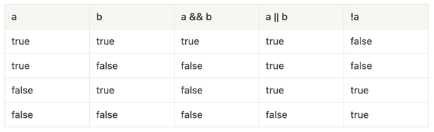

## 고급언어 : 소스코드 → 기계어 → 실행

---

### 컴파일 방식 : 프로그램 O

컴파일 방식은 소스코드를 한 번에 기계어로 번역하고 실행파일을 생성하는 방식입니다. 이 방식은 실행파일을 생성하므로, 소스코드를 수정하거나 재컴파일하지 않은 이상 같은 작업을 반복할 때마다 번역 과정을 거치지 않아도
됩니다. 또한 실행파일이 생성되므로, 소스코드를 보호할 수 있습니다. 또한 실행 속도가 빠르며, 대부분의 운영체제에서 지원됩니다. 하지만, 한 번 생성된 실행파일을 수정하려면 다시 컴파일해야 하며, 다양한 운영체제에
맞춰 컴파일해야 하는 불편함이 있습니다.

- 장점 : 빠르다
- 단점 : 코드 작성 및 테스트, 유지보수 어려움
- C, C++ 등 (Java는 컴파일에 가까운 하이브리드형)

### 인터프리터 방식 : 프로그램 X

인터프리터 방식은 소스코드를 한 줄씩 기계어로 번역하고 실행하는 방식입니다. 이 방식은 실행하려는 코드가 있는 파일을 인터프리터로 실행하므로, 실행파일이 생성되지 않습니다. 따라서 코드를 수정하거나 작업을 반복할
때마다 항상 인터프리터가 번역 과정을 거쳐야 합니다. 실행할 때마다 번역 과정을 거치므로, 실행 속도가 느릴 수 있습니다. 하지만, 코드 수정이 간편하며, 운영체제에 독립적입니다.

두 방식의 선택은 사용하는 용도와 개발 환경에 따라 결정됩니다. 컴파일 방식은 대규모 프로젝트나 배포용 소프트웨어에 적합하며, 인터프리터 방식은 개발 중인 소프트웨어에서 코드 수정과 디버깅이 자주 일어나는 경우
적합합니다. 또한, 최근에는 두 방식을 혼용하는 JIT 컴파일러나 AOT 컴파일러도 나오고 있어, 사용 목적에 맞게 선택할 수 있는 다양한 옵션이 제공됩니다.

- 장점 : 코드 작성 및 테스트, 유지보수 용이함
- 단점 : 느리다
- JavaScript, Python 등

    - 변수(variable)

      변수(variable)는 값을 저장하는 메모리 공간입니다. 변수에는 언제든지 새로운 값을 저장할 수 있습니다. 변수는 다음과 같이 선언합니다.

        ```jsx
        변수타입 변수이름;
        ```

      상수(constant)는 값을 변경할 수 없는 변수입니다. 상수는 다음과 같이 선언합니다.

        ```jsx
        const 변수타입 상수이름 = 값;
        ```

      예를 들어, int 타입의 상수 MAX_NUM을 선언하면 다음과 같습니다.

        ```jsx
        const MAX_NUM = 100;
        ```

      상수는 값을 변경할 수 없기 때문에, 한 번 값을 지정하면 이후에 값을 변경할 수 없습니다. 변수와 상수의 선택은 값이 변경되는지 여부에 따라 결정됩니다.

      ## 변수 선언 규칙

        ```jsx
        // 변수 이름은 의미 있는 이름으로 작성해야 하며, 알파벳, 숫자, 언더바(_)를 사용할 수 있습니다. 하지만, 변수 이름은 숫자로 시작할 수 없으며, 예약어를 사용할 수 없습니다. 변수 이름은 카멜 표기법(camelCase)을 사용하여 각 단어의 첫 글자를 대문자로 작성하는 것이 관례입니다.
        let age;
        let height;
        let isMarried;
        let name;
      
        // 변수 타입은 변수가 저장하는 값의 자료형을 나타내며, 기본 자료형으로는 int, double, boolean, char 등이 있고, 사용자 정의 자료형으로는 String, Date, List 등이 있습니다. 변수 선언 시 변수 타입 다음에 변수 이름을 적어주면 됩니다.
        age = 30;
        height = 175.0;
        isMarried = true;
        name = "홍길동";
      
        // 변수를 사용하기 전에 반드시 초기화해야 합니다. 초기화란 변수에 값을 할당하는 것을 의미합니다. 변수를 초기화하지 않은 상태에서 변수를 사용하면 컴파일 오류가 발생합니다.
        const MAX_NUM = 100;
      
        // 상수는 값을 변경할 수 없으므로, 변수와 구분하기 위해 대문자와 언더바(_)를 사용하여 작성하는 것이 관례입니다.
        ```

      ## 변수 선언하기

        ```jsx
        var currentYear; // 올해 연도 변수 선언
        var birthYear; // 태어난 연도 변수 선언
      
        // 변수 한번에 선언하기 
        var currentYear, birthYear;
        ```

      ## 자료형

      | 종류 |  | 설명 | 예시 |
      | --- | --- | --- | --- |
      | 기본유형 | 숫자형 | 따옴표 없이 숫자로만 표기합니다. | var birthYear = 2000; |
      |  | 문자열 | 작은따옴표나 큰따옴표로 묶어서 나타냅니다.
        숫자를 따옴표로 묶으면 문자로 인식합니다. | var greeting = ‘Hello!’;
        var birthYear = ‘2000’; |
      |  | 논리형 | 참과 거짓이라는 2가지 값만 있는 유형입니다.
        소문자로만 표시합니다. | var isEmpty = true; |
      | 복합유형 | 배열
        (자료구조, object) | 하나의 변수에 여러 개의 값을 저장합니다. | var seasons =[’봄’, ‘여름’, ‘가을’, ‘겨울’]; |
      |  | 객체 | 함수와 속성을 함계 포함합니다. | var date = new Date(); |
      | 특수유형 | undefined | 자료형이 지정되지 않았을 때의 상태입니다. 
        예를 들어 변수선언만 하고 값을 할당하지 않은(초기화 하지 않은) 변수는 undefined 상태입니다. |  |
      |  | null | 값이 유효하지 않을 때의 상태입니다. |  |
       + 문자열 String
       + 논리형 boolean

      ## 자바스크립트에서 false를 의미하는 5가지의 값

        ```jsx
        var bool1 = Boolean(0);
        var bool2 = Boolean(NaN);
        var bool3 = Boolean('');
        var bool4 = Boolean(null);
        var bool5 = Boolean(undefined);
        ```

      ## 연산자

      | 연산자 | 설명 |
                                                        | --- | --- |
      | + | 덧셈 |
      | - | 뺄셈 |
      | * | 곱셈 |
      | / | 나눗셈 |
      | % | 나머지 연산 |
      | ++ | 증가 연산 |
      | -- | 감소 연산 |
      | = | 대입 연산 |
      | += | 더하기 후 대입 연산 |
      | -= | 빼기 후 대입 연산 |
      | *= | 곱하기 후 대입 연산 |
      | /= | 나누기 후 대입 연산 |
      | %= | 나머지 연산 후 대입 연산 |
      | == | 같음을 비교 |
      | != | 다름을 비교 |
      | > | 큰지 비교 |
      | < | 작은지 비교 |
      | >= | 크거나 같은지 비교 |
      | <= | 작거나 같은지 비교 |
      | && | 논리곱 |
      | ` |  |
      | ! | 논리 부정 |
      | ** | 거듭제곱 연산 |

      ### 예시

        - 더하기 연산

        ```jsx
        var x = 10;
        var y = 20;
        var z = x + y; // 30
        ```

        - 대입 연산

        ```jsx
        var x = 10;
        var y = 20;
        x += y; // x = x + y; 와 같은 의미이며, x는 30이 됩니다.
        ```

        - 같음을 비교

        ```jsx
        var x = 10;
        var y = "10";
        x == y; // true (값만 비교하므로 같다고 판단합니다.)
        x === y; // false (값과 타입을 함께 비교하므로 다르다고 판단합니다.)
        ```

        - 거듭제곱

        ```jsx
        // **은 거듭제곱 연산자 
        // ::: op1 ** op2 -> op1 : 밑, op2 : 지수
        console.log(2 ** 3); 
        console.log(2 ** 2 ** 2);
        console.log(2 ** 3 ** 2);
        console.log((2 ** 3) ** 2);
        ```

      | 연산자 | 설명    |
                                    |-----|-------|
      | &&  | and 연산자 |
      | ll  | or 연산자 |
      | !   | 논리 부정 |

      ### 예시
      
  