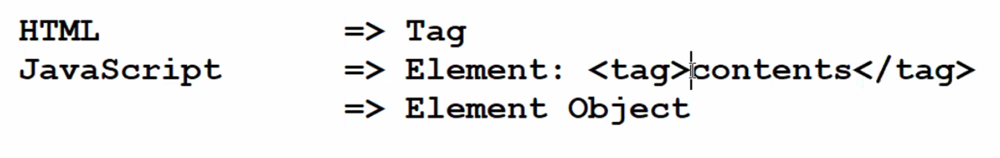

## window 내장 객체란?

window 내장 객체는 브라우저 창 자체를 나타내는 객체입니다. 모든 JavaScript 코드는 window 객체의 프로퍼티나 메소드를 참조할 수 있습니다.

window 객체는 브라우저 창의 크기, 스크롤 위치, 브라우저 히스토리, 브라우저와 관련된 다양한 이벤트 등을 다루는 데 사용됩니다. 또한, window 객체는 다른 프레임이나 iframe 안에서 실행되는
스크립트에서도 사용됩니다.

### window 객체의 일부 메소드와 프로퍼티는 다음과 같습니다.
  - alert(): 경고창을 띄웁니다.
  - confirm(): 확인/취소를 선택할 수 있는 대화상자를 띄웁니다.
  - prompt(): 사용자로부터 입력을 받을 수 있는 대화상자를 띄웁니다.
  - open(): 새로운 브라우저 창을 엽니다.
  - close(): 현재 브라우저 창을 닫습니다.
  - setInterval(): 일정 간격으로 함수를 실행합니다.
  - setTimeout(): 일정 시간 후에 함수를 실행합니다. 
  
### window 객체는 다양한 브라우저와 관련된 정보를 담고 있습니다. 이러한 정보는 다음과 같습니다.
  - navigator: 브라우저와 관련된 정보를 담고 있습니다.
  - screen: 스크린과 관련된 정보를 담고 있습니다.
  - location: 현재 페이지의 URL 정보를 담고 있습니다.

## 이벤트를 처리하기 위한 속성 (이벤트 핸들러)

이벤트를 처리하기 위한 요소 객체는 반드시 해당 이벤트를 처리하기 위한 이벤트 속성(프로퍼티)을 가지고 있어야 합니다.

`onload` 이벤트는 객체가 로드될 때 발생합니다. `window` 객체의 경우, `onload` 이벤트는 페이지 전체가 로드될 때(이미지 및 스크립트와 같은 모든 콘텐츠 포함) 트리거됩니다. 페이지가 완전히
로드된 후 JavaScript 코드를 실행하는 데 `onload` 이벤트를 사용할 수 있습니다.

예를 들어 페이지가 로드된 후 사용자에게 메시지를 표시하거나 페이지 콘텐츠에 따라 일부 JavaScript 변수 또는 함수를 초기화하는 데 `onload` 이벤트를 사용할 수 있습니다.

`window` 객체와 `onload` 이벤트를 사용하려면, `window.onload` 속성에 함수를 할당할 수 있습니다. 이 함수는 페이지가 로드된 후 실행됩니다. 다음은 예입니다.

```jsx
window.onload = function () {
    console.log('페이지가 로드되었습니다!');
};
```

`addEventListener()` 메소드를 사용하여 `window` 객체에 `onload` 이벤트 리스너를 추가할 수도 있습니다. 다음은 예입니다.

```jsx
window.addEventListener('load', function () {
    console.log('페이지가 로드되었습니다!');
});
```

```jsx
<script>
    // event property : 'on' + eventName 발생한 이벤트와 이벤트 처리를 위한 핸들러를 연결하는 역할
    // event handler : function () {...}
    window.onload = function () {
    document.body.innerHTML = '<h1>Hello World</h1>';
}
</script>
```

## Java와 JavaScript의 배열차이

1. 선언 방법:
   Java에서 배열을 선언할 때에는 데이터 타입을 명시하고, 배열의 크기를 지정해야 합니다. JavaScript에서는 배열의 크기를 지정하지 않아도 되며, 데이터 타입도 지정하지 않아도 됩니다.
2. 크기 조정:
   Java에서는 배열의 크기가 고정되어 있으며, 변경할 수 없습니다. JavaScript에서는 배열의 크기를 동적으로 조정할 수 있습니다.
3. 다차원 배열:
   Java에서는 다차원 배열을 지원합니다. JavaScript에서는 다차원 배열을 지원하지 않지만, 배열 안에 또다른 배열을 넣어서 다차원 배열과 비슷한 효과를 낼 수 있습니다.
4. 배열 요소의 타입:
   Java에서는 배열의 요소가 모두 같은 데이터 타입이어야 합니다. JavaScript에서는 배열의 요소가 서로 다른 데이터 타입이어도 됩니다.
5. 배열 메소드:
   Java에서는 배열 메소드를 지원하지 않습니다. JavaScript에서는 배열 메소드를 지원하며, 배열을 다루는 데 유용한 여러 가지 메소드가 있습니다. (예: push(), pop(), shift(),
   unshift(), splice(), slice() 등)
6. 배열의 인덱스:
   Java에서는 배열의 첫 번째 요소의 인덱스가 0입니다. JavaScript에서도 마찬가지입니다.
7. 배열 요소에 접근:
   Java에서 배열 요소에 접근할 때에는 인덱스를 사용하여 접근합니다. JavaScript에서도 마찬가지이지만, 배열 요소에 접근할 때 대괄호([])를 사용하여 접근합니다.

이러한 차이점들로 인해 Java와 JavaScript의 배열은 구현 방법과 특징이 다르기 때문에 서로 호환되지 않습니다.

```jsx
var arr = ['사과', '배', '딸기'];

arr[3] = '배';

arr.splice(1, 1); // 값을 제거하는 것이 아닌 공간을 제거 하는 것.

console.log(arr);
```

## for - in 반복문(배열과 객체에서만 사용)

JavaScript에서 for-in 반복문은 객체의 속성들을 반복적으로 순회하기 위해 사용됩니다. 이 반복문은 객체의 열거 가능한 속성들을 모두 순회합니다. 이 때, 객체의 프로토타입 체인에서 상속받은 속성들도
포함됩니다. for-in 반복문의 일반적인 구문은 다음과 같습니다.

```jsx
for (variable in object) {
    // 실행할 코드
}
```

여기서 `variable`은 현재 순회중인 속성의 이름을 저장하는 변수입니다. `object`는 순회할 객체입니다.

중요한 점은 for-in 반복문은 배열에서 사용하면 예상치 못한 결과를 초래할 수 있다는 것입니다. 자바스크립트의 배열은 숫자 인덱스 외에도 추가적인 속성을 가지는 객체입니다. 따라서 배열을 순회할 때는 for-of
반복문이나 forEach() 메소드를 사용해야 합니다.

```jsx
const myObj = {a: 1, b: 2, c: 3};

for (let prop in myObj) {
    console.log(`${prop}: ${myObj[prop]}`);
}
// 출력:
// a: 1
// b: 2
// c: 3
```

위 예제에서는 for-in 반복문을 사용하여 `myObj` 객체의 속성들을 순회합니다. 반복문은 각 속성의 이름을 `prop` 변수에 저장하고, 속성 이름과 해당 속성의 값 모두를 콘솔에 출력합니다.

### 예시

```jsx
/*
        사용자에게 연도를 입력받아, 윤년 여부를 판단하여 출력하는 코드를 작성하세요.
        [코드 작성 유형]
        1. if, else if, else 사용
        2. if. else 사용
        */
var year = prompt('년도를 입력하삼요', 2023);
year = Number(year);

if (year != 0) {
    if (year % 4 == 0 && year % 100 == 0 || year % 400 == 0) {
        var result = '윤년';
    } else {
        var result = '평년';
    }
} else {
    console.log('올바른 년도를 입력하삼요')
}

console.log('입력한' + year + '년도는 ' + result + '임다.')
```

```jsx
/*
 사용자에게 연 월을 입력받아 입력받은 월의 마지막 일자를 반환하는 코드를 작성
 단, 스위치 문으로 해결하삼요
*/

var monthLastDay;
var yearNmonth = prompt('년, 월을 입력하삼요', '2023 7');
yearNmonth = yearNmonth.split(' ');
yearNmonth[0] = Number(yearNmonth[0]);
yearNmonth[1] = Number(yearNmonth[1]);

switch (yearNmonth[1]) {
    case 4:
    case 6:
    case 9:
    case 11:
        monthLastDay = 30;
        break;
    case 2:
        switch (true) {
            case yearNmonth[0] % 4 == 0 && yearNmonth[0] % 100 == 0 || yearNmonth[0] % 400 == 0 :
                monthLastDay = 29;
                break;
            default :
                monthLastDay = 28;
                break;
        }
        break;

    default:
        monthLastDay = 31;
        break;
}

console.log('입력하신 ' + yearNmonth[0] + '년 ' + yearNmonth[1] + '의 마지막 일자는 ' + monthLastDay + '일임')
```

```jsx
/*
          사용자에게 연도를 입력받아, 윤년 여부를 판단하여 출력하는 코드를 작성하세요.
          단, 삼항 연산자를 사용합니다.
        */

var result;
var year = prompt('년도를 입력하삼요', 2023);
year = Number(year);

year != 0 ?
    year % 4 == 0 && year % 100 == 0 || year % 400 == 0 ?
        result = '윤년' : result = '평년'
    :
    console.log('올바른 년도를 입력하삼요');

Boolean(result) ? console.log('입력한' + year + '년도는 ' + result + '임다.') : null;
```

```jsx
var gugu = '';
for (var num = 0; num <= 9; num++) {
    document.write('<tr>');

    for (var dan = 2; dan <= 9; dan++) {
        if (num == 0) {
            document.write('<th>' + dan + '단 </th>');
        } else {
            document.write('<td>' + dan + ' * ' + num + ' = ' + (dan * num) + '</td>')
        }
    }
    gugu += ('</tr>');
}
```

```jsx
var gugu = '<table>';

for (var num = 0; num <= 9; num++) {
    gugu += '<tr>';

    for (var dan = 2; dan <= 9; dan++) {
        if (num == 0) {
            gugu += '<th>' + dan + '단 </th>';
        } else {
            gugu += '<td>' + dan + ' * ' + num + ' = ' + (dan * num) + '</td>'
        }
    }
    gugu += '</tr>';
}
gugu += '</table>'

window.onload = function () {
    document.body.innerHTML += gugu;
    // inerHTML에 +=를 쓰면 어팬드가 됨

}
```

```jsx
/*
        사용자에게 날짜를 입력받아 입력받은 날짜를 요일로 반환하는 코드
        */
var totalDays = 0;
var monthLastDays = [-1, 31, 28, 31, 30, 31, 30, 31, 31, 30, 31, 30, 31];
var week = ['일', '월', '화', '수', '목', '금', '토'];
var ymd = prompt('몇년? 몇월 몇일?', '2023 7 5');
ymd = ymd.split(' ');
for (var i = 0; i < ymd.length; i++) {
    ymd[i] = Number(ymd[i]);
}
for (var i = 1; i < ymd[0]; i++) {
    if (i % 4 == 0 && i % 100 != 0 || i % 400 == 0) {
        totalDays = 366;
    } else {
        totalDays = 365;
    }
}
if (ymd[0] % 4 == 0 && ymd[0] % 100 != 0 || ymd[0] % 400 == 0) {
    monthLastDays[2] = 29;
}
for (var i = 1; i < ymd[1]; i++) {
    totalDays += monthLastDays[i];
}

totalDays += ymd[2];
console.log('입력하신 ' + ymd[0] + '년' + ymd[1] + '월' + ymd[2] + '일은' + week[totalDays % 7] + '요일 입니다. ')
```

```jsx
// Math.radom() 매서드를 사용하여 1부터 45 사이의 로또번호 하나를 생성하는 코드 작성
var lottoNum = parseInt(Math.random() * 45) + 1;

console.log(lottoNum);
```

```jsx
// 1부터 100까지의 합은 5050 입니다. 1부터 몇까지의 합이 최초로 1000을 초과 할까요?
var i = 0, sum = 0;

while (sum <= 1000) {
    i++;
    sum += i;
}

console.log('1 부터 ' + i + '까지의 합이 ' + sum + '임');
```

```jsx
// 1부터 100까지의 합은 5050 입니다. 1부터 몇까지의 합이 최초로 1000을 초과 할까요? break문 사용
var i = 1, sum = 0;

while (true) {
    sum += i;

    if (sum > 1000) {
        break;
    }
    i++;

}

console.log('1 부터 ' + i + '까지의 합이 ' + sum + '임');
```

```jsx
// 이길때까지 가위바위보 하는 코드작성
var kbb = ['가위', '바위', '보'];
var user, com, result, msg = 0;
var win = false;

do {
    user = prompt('가위 바위 보', 1) - 1;
    com = Math.floor(Math.random() * 3);

    switch (user - com) {
        case 0:
            result = "비김";
            break;
        case 1:
        case -2:
            result = "이김";
            win = true;
            break;
        case -1:
        case 2:
            result = "짐";
            break;
    }
    msg = '사용자 :' + kbb[user] + '컴퓨터 :' + kbb[com] + ' 결과 ' + result;
} while (!win);

console.log(result);
```

```jsx
// 1부터 100 사이의 값 중 3의 배수들의 합을 구하는 코드
// for, continue 사용
var sum = 0;

for (var i = 1; i <= 100; i++) {
    if (i % 3 != 0) {
        continue;
    }
    sum += i; // 무한루프에 빠지지 않기 위해 
}
console.log(sum);
```

```jsx
// 1부터 100 사이의 값 중 3의 배수들의 합을 구하는 코드
// while, continue 사용
var i = 1, sum = 0;

while (i <= 100) {

    if (i % 3 != 0) {
        i++; // 무한루프에 빠지지 않기 위해 
        continue
    }
    sum += i;
    i++; // 무한루프에 빠지지 않기 위해 
}

console.log(sum);
```
  