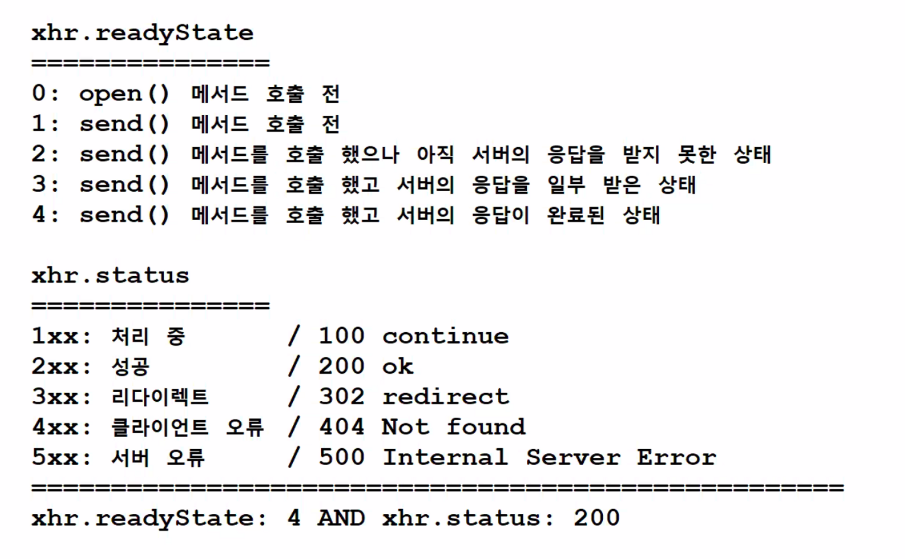

### ⭐️ 역대급 고난과 역경의 날2



### xhr.readyState

| xhr.readyState | 설명                                    |
|----------------|---------------------------------------|
| 0              | open() 메서드 호출 전                       |
| 1              | send() 메서드 호출 전                       |
| 2              | send() 메서드를 호출했으나 아직 서버의 응답을 받지 못한 상태 |
| 3              | send() 메서드를 호출했고 서버의 응답을 일부 받은 상태     |
| 4              | send() 메서드를 호출했고 서버의 응답이 완료된 상태       |

→ 서버가 응답을 요청할 때 StatusCode를 첨부합니다.

### xhr.status

| StatusCode | 설명                        |
|------------|---------------------------|
| 1xx        | 처리 중, 유지 중                |
|            | 100 continue              |
| 2xx        | 성공                        |
|            | 200 ok                    |
| 3xx        | 리다이렉트                     |
|            | 302 redirect              |
| 4xx        | 클라이언트 오류                  |
|            | 404 not found             |
| 5xx        | 서버 오류                     |
|            | 500 internal server error |

클라이언트가 서버에 붙은것이 성공한 코드 : xhr.readyState: 4 And xhr.status: 200

⇒ event: **readystatechange**

### ajax 예시

```jsx
var xhr = new XMLHttpRequest();
xhr.addEventListener('readystatechange', ajaxHandler);

function ajaxHandler() {
    if (xhr.readyState === 4 && xhr.status === 200) {
        var personsChild = parsePersonsJSON(xhr.responseText);
        var persons = document.querySelector('#persons');
        persons.innerHTML = '';

        for (var i in personsChild) {
            persons.appendChild(personsChild[i]);
        }
    }
}

function parsePersonsJSON(jsonStr) {
    var persons = JSON.parse(jsonStr);

    for (var i in persons) {
        var content = '<h4>이름: ' + persons[i].name + '</h4>';
        content += '<h4>성별: ' + persons[i].gender + '</h4>';
        content += '<h4>나이: ' + persons[i].age + '</h4>';
        content += '<h4>분야: ' + persons[i].field + '</h4>';

        var div = document.createElement('div');
        div.setAttribute('class', 'person');
        div.innerHTML = content;

        persons[i] = div;
    }

    return persons;
}

function sendHandler() {
    xhr.open('GET', 'persons.json', true);
    xhr.send();
}

function clearHandler() {
    document.querySelector('#persons').innerHTML = '';
}

function init() {
    document.querySelector('#send').addEventListener('click', sendHandler);
    document.querySelector('#clear').addEventListener('click', clearHandler);
}

window.addEventListener('load', init);
```