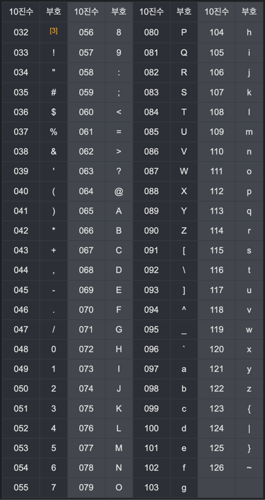

- 프로그래밍 언어별 사용처

  Java는 크로스 플랫폼 언어로, 다양한 운영 체제에서 동작하는 프로그램을 작성할 수 있습니다. Java는 안정성과 보안성이 높아, 주로 기업용 시스템에서 사용됩니다.(서버)

  Python은 간결하고 쉬운 문법을 가지고 있어, 빠르게 프로토타입을 만들어내는 데 효과적입니다. Python은 머신러닝, 데이터 분석, 웹 개발 등 다양한 분야에서 사용됩니다.

  C는 하드웨어 제어 및 시스템 프로그래밍과 같은 분야에서 널리 사용되는 언어입니다. C는 저수준의 메모리 제어를 할 수 있는 능력이 강하며, 시스템 프로그래밍에서 필요한 다양한 기능을 제공합니다.

- 코드와 인코딩, 디코딩

  코드(Code)는 문자를 숫자로 변환하는 규칙을 정의한 것입니다. 각 문자는 특정한 숫자와 대응되며, 이를 이용하여 문자열을 숫자열로 변환할 수 있습니다.

  인코딩(Encoding)은 문자를 숫자로 변환하는 과정을 말합니다. 예를 들어, ASCII 인코딩은 영어 알파벳과 일부 특수문자를 7비트 숫자로 변환합니다. 따라서, "A"는 65, "B"는 66, "C"는 67으로 인코딩됩니다.

  디코딩(Decoding)은 인코딩된 숫자열을 다시 문자열로 변환하는 과정을 말합니다. 예를 들어, ASCII 디코딩은 7비트 숫자를 영어 알파벳과 일부 특수문자로 변환합니다. 따라서, 65는 "A", 66은 "B", 67은 "C"로 디코딩됩니다.

- 아스키 코드표


- 유니코드(Unicode)

  유니코드(Unicode)는 전 세계의 모든 문자를 하나의 코드 체계로 표현하는 국제 표준이며, 대부분의 문자 인코딩 방식에서 사용됩니다. 이를 이용하여, 한글, 일본어, 중국어 등 다양한 언어를 컴퓨터에서 표현할 수 있습니다. 유니코드는 16비트(2바이트)로 문자를 표현하며, UTF-8과 UTF-16 등 다양한 인코딩 방식이 있습니다.

  `char`는 자바에서 문자를 표현하는 데이터 타입 중 하나입니다. `char` 변수는 2바이트의 메모리 공간을 차지하며, 유니코드 문자를 저장할 수 있습니다. `char` 변수에는 작은따옴표(')로 감싼 유니코드 문자나 이스케이프 시퀀스를 할당할 수 있습니다.

  예를 들어, `char c = 'A';`와 같이 변수 `c`에 문자 'A'를 할당할 수 있습니다. 또한, `char d = '\\u0041';`와 같이 변수 `d`에 유니코드 문자 'A'를 할당할 수도 있습니다.

- 값의 범위
    - **byte**: 8비트 크기의 부호 있는 정수 타입입니다. `128`부터 `127`까지의 값을 저장할 수 있습니다. 대표적으로 파일 입출력과 같은 바이너리 데이터를 다룰 때 사용됩니다.
    - **short**: 16비트 크기의 부호 있는 정수 타입입니다. `32,768`부터 `32,767`까지의 값을 저장할 수 있습니다. `byte`보다 큰 범위의 정수를 다룰 때 사용됩니다.
    - **int**: 32비트 크기의 부호 있는 정수 타입입니다. `2,147,483,648`부터 `2,147,483,647`까지의 값을 저장할 수 있습니다. 대부분의 정수값을 다룰 때 사용됩니다.
    - **long**: 64비트 크기의 부호 있는 정수 타입입니다. `9,223,372,036,854,775,808`부터 `9,223,372,036,854,775,807`까지의 값을 저장할 수 있습니다. `int`보다 큰 범위의 정수를 다룰 때 사용됩니다.
    - **char**: 16비트 크기의 부호 없는 유니코드 문자 타입입니다. `'\\u0000'`부터 `'\\uffff'`까지의 값을 저장할 수 있습니다. 유니코드 문자를 저장할 때 사용됩니다.
    - **float**: 32비트 크기의 부동 소수점 타입입니다. 대략 7자리의 유효숫자를 저장할 수 있습니다. 실수값을 단정도 부동 소수점 형태로 저장할 때 사용됩니다.
    - **double**: 64비트 크기의 부동 소수점 타입입니다. 대략 15자리의 유효숫자를 저장할 수 있습니다. 실수값을 배정도 부동 소수점 형태로 저장할 때 사용됩니다.

  ### + 형변환

  형변환이란, 변수의 데이터 타입을 다른 데이터 타입으로 변환하는 것입니다. 형변환을 할 때에는 변환하려는 데이터 타입을 명시해야 합니다.

    - **자동 형변환(묵시적 형변환)**: 작은 데이터 타입에서 큰 데이터 타입으로 변환할 때 자동으로 형변환이 일어나는 것을 말합니다. 예를 들어, `int` 타입의 변수에 `byte` 타입의 값을 할당할 때, 자동으로 `byte` 타입의 값을 `int` 타입으로 변환합니다.
    - **강제 형변환(명시적 형변환)**: 큰 데이터 타입에서 작은 데이터 타입으로 변환할 때 명시적으로 형변환을 해야하는 것을 말합니다. 예를 들어, `double` 타입의 값을 `float` 타입으로 변환할 때, 명시적으로 `(float)` 형변환을 해주어야 합니다.
      ex)

        ```java
        byte b = 127;
        ```

- 기본형 변수

  

  

- 과학적 표기법

    ```java
    double a = 1.2345e6; // 1,234,500
    double b = 1.2345e-6; // 0.0000012345
    ```

  위 코드에서 `e`는 10의 거듭제곱을 의미합니다. `1.2345e6`은 1,234,500을, `1.2345e-6`은 0.0000012345를 나타냅니다.

- 다양한 정수 표기법

    ```java
    public static void main(String[] args) {
    		int num1, num2, num3, num4;
    		num1 = 104;
    		num2 = 0x68;
    		num3 = 0150;
    		num4 = 0b1101000;
    		
    		System.out.println("num1: " + num1);
    		System.out.println("num2: " + num2);
    		System.out.println("num3: " + num3);
    		System.out.println("num4: " + num4);
    	}
    ```

- 형변환(Casting)

  byte는 -128에서 127까지만 포함할 수 있기 때문에 형변환을 해주어야 합니다. 형변환을 위해 128앞에 (byte)를 넣습니다.

    ```java
    public static void main(String[] args) {
    		byte b = (byte)128;
    
    	}
    ```

  ### + 다운캐스팅(Downcasting)

  상위 클래스 타입의 객체를 하위 클래스 타입으로 변환하는 것을 말합니다. 다운캐스팅을 할 때에는 명시적으로 형변환을 해주어야 합니다.

    ```java
    class Animal {
      public void move() {
        System.out.println("동물이 움직입니다.");
      }
    }
    
    class Dog extends Animal {
      public void move() {
        System.out.println("개가 움직입니다.");
      }
    }
    
    class Cat extends Animal {
      public void move() {
        System.out.println("고양이가 움직입니다.");
      }
    }
    
    public class Test {
      public static void main(String[] args) {
        Animal animal = new Animal();   // Animal 객체 생성
        Dog dog = new Dog();            // Dog 객체 생성
        Cat cat = new Cat();            // Cat 객체 생성
    
        animal.move();   // 실행결과: 동물이 움직입니다.
        dog.move();      // 실행결과: 개가 움직입니다.
        cat.move();      // 실행결과: 고양이가 움직입니다.
    
        Animal a1 = new Dog();  // 다형성 적용: 상위 클래스 타입의 객체에 하위 클래스 타입의 객체를 할당
        Animal a2 = new Cat();  // 다형성 적용: 상위 클래스 타입의 객체에 하위 클래스 타입의 객체를 할당
    
        a1.move();      // 실행결과: 개가 움직입니다.
        a2.move();      // 실행결과: 고양이가 움직입니다.
    
        Dog d = (Dog)a1;   // 다운캐스팅: 상위 클래스 타입의 객체를 하위 클래스 타입으로 변환
        d.move();          // 실행결과: 개가 움직입니다.
      }
    }
    
    ```

  ### + 암시적 형변환(Implicit Casting)

  작은 크기의 데이터 타입에서 큰 크기의 데이터 타입으로 변환할 때 자동으로 형변환이 일어나는 것을 말합니다.

    ```
    int a = 10;
    double b = a;   // 암시적 형변환: int 타입의 변수를 double 타입의 변수에 할당
    
    ```

- 정밀도

  자바에서 사용되는 데이터 타입 중에서 float와 double의 차이점에 대해서 다루고 있습니다. float는 소수점 이하의 정밀도가 낮기 때문에, 정확한 값이 필요한 경우에는 double을 사용하는 것이 좋습니다.

    ```java
    public static void main(String[] args) {
    		float f = 0.12345678901234567890f;
    		double d = 0.12345678901234567890;
    		
    		System.out.println("f: " + f);
    		System.out.println("d: " + d);
    
    	}
    
    f: 0.12345679
    d: 0.12345678901234568
    ```

- `printf`서식 지정자


    | 서식 지정자 | 설명 |
    | --- | --- |
    | %d | 정수값 출력 |
    | %f | 실수값 출력 |
    | %c | 문자값 출력 |
    | %s | 문자열 출력 |
    | %b | 논리값 출력 |
    | %o | 8진수 값 출력 |
    | %x | 16진수 값 출력 |
    | %e | 지수형태의 실수값 출력 |
    | %t | 날짜/시간 값 출력 |
    | %n | 줄바꿈 문자(\n) |

- Main 메소드

  main 메소드의 형태는 `public static void main(String[] args)`입니다. 이때, `public`은 해당 메소드가 다른 클래스에서도 접근 가능하다는 것을 의미하고, `static`은 해당 메소드가 클래스의 인스턴스를 생성하지 않고도 호출 가능하다는 것을 의미합니다. `void`는 메소드의 반환 값이 없음을 의미합니다. `String[] args`는 프로그램 실행 시에 전달되는 인자들을 배열 형태로 받는 매개변수입니다.

  따라서, main 메소드를 가지는 클래스는 반드시 `public class`로 선언되어야 하며, main 메소드의 형태는 `public static void main(String[] args)`와 같습니다.

- 연산자

  산술 연산자: 사칙연산(+, -, *, /) 및 나머지 연산자(%) 등을 포함하는 연산자입니다.

  비교 연산자: 비교 연산자는 두 개의 값을 비교하여 참(true) 또는 거짓(false)으로 반환합니다. 비교 연산자에는 등호(==), 등호가 아닌(!=), 작거나(<), 작거나 같거나(<=), 크거나(>), 크거나 같거나(>=)와 같은 연산자가 있습니다.

  논리 연산자: 논리 연산자는 논리값(true 또는 false)을 연산하는 데 사용됩니다. 논리 연산자에는 논리 곱(&&), 논리 합(||), 그리고 부정(!) 연산자가 있습니다.

    - 연산자의 우선순위