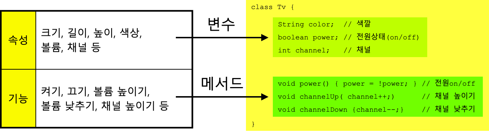

- 객체지향

  객체지향 프로그래밍(OOP)은 프로그램을 객체들의 집합으로 구성하고 객체들 간의 상호작용을 통해 프로그램을 만드는 프로그래밍 패러다임입니다. 객체지향 개념은 다음과 같은 특징을 갖습니다.

    - 캡슐화: 객체의 상태와 행위를 하나로 묶어 관리하고, 외부에서 직접 접근하지 못하도록 은닉합니다.
    - 상속: 부모 클래스에서 정의한 속성과 메서드를 자식 클래스가 물려받아 재사용할 수 있습니다.
    - 다형성: 동일한 이름의 메서드가 서로 다른 클래스에서 다른 기능을 수행할 수 있습니다.
    - 추상화: 객체의 공통된 속성과 기능을 추출하여 모델링합니다.

  ### 예제

  다음은 Java 언어로 작성된 간단한 예제입니다.

    ```java
    public class Animal {
        private String name;
        private int age;
    
        public Animal(String name, int age) {
            this.name = name;
            this.age = age;
        }
    
        public void sayName() {
            System.out.println("My name is " + name);
        }
    
        public void sayAge() {
            System.out.println("I am " + age + " years old");
        }
    }
    
    public class Dog extends Animal {
        public Dog(String name, int age) {
            super(name, age);
        }
    
        public void bark() {
            System.out.println("Bow wow");
        }
    }
    
    public class Main {
        public static void main(String[] args) {
            Dog myDog = new Dog("Pochi", 3);
            myDog.sayName();
            myDog.sayAge();
            myDog.bark();
        }
    }
    
    ```

  위 코드에서 `Animal` 클래스는 동물의 이름과 나이를 저장하고 출력하는 메서드를 가지고 있습니다. `Dog` 클래스는 `Animal` 클래스를 상속받아서 `bark` 메서드를 추가로
  구현하였습니다. `Main` 클래스에서는 `Dog` 클래스의 객체를 생성하고 출력합니다.

  ### 정리

  객체지향 개념은 프로그램을 보다 모듈화하고 유지보수하기 쉽게 만들어줍니다. 이번 강의에서는 캡슐화, 상속, 다형성, 추상화 등의 개념을 소개하였고, Java 언어로 간단한 예제를 작성해보았습니다.

- 객체(object), 클래스(class), 인스턴스(instance)
    - 객체는 속성과 행위를 가지는 개체(entity)입니다.
    - 클래스는 객체를 만들기 위한 설계도입니다.
    - 인스턴스는 클래스를 기반으로 실제로 메모리에 할당된 객체를 의미합니다.

  ### 예제

    ```java
    public class Person {
        private String name;
        private int age;
    
        public Person(String name, int age) {
            this.name = name;
            this.age = age;
        }
    
        public void sayHello() {
            System.out.println("Hello, my name is " + name);
        }
    }
    
    public class Main {
        public static void main(String[] args) {
            Person person1 = new Person("Alice", 25);
            Person person2 = new Person("Bob", 30);
            person1.sayHello();
            person2.sayHello();
        }
    }
    ```

  위 코드에서 `Person` 클래스는 사람의 이름과 나이를 저장하고 출력하는 메서드 `say_hello`를 가지고 있습니다. `person1`과 `person2`는 `Person` 클래스의
  인스턴스입니다. `person1.say_hello()`는 "Hello, my name is Alice"를 출력하고, `person2.say_hello()`는 "Hello, my name is Bob"을
  출력합니다.

  ### 정리

  객체를 설계하고 사용하는 것은 프로그래밍에 있어서 중요한 개념입니다. 객체는 속성과 행위를 가지며, 클래스를 기반으로 인스턴스가 생성됩니다. 이번 수업에서는 객체, 클래스, 인스턴스에 대해 간단히 설명하였습니다.

  

    <aside>
    🔼 객체지향 프로그래밍에서 맴버변수(instance 변수)는 객체의 상태를 나타내는 변수입니다. 
    맴버변수는 클래스 내부에서 정의되며, 각 객체마다 서로 다른 값을 가질 수 있습니다. 
    맴버변수는 캡슐화를 통해 외부에서 직접 접근하지 못하도록 보호될 수 있습니다. 
    위 코드에서 `Animal` 클래스의 `name`과 `age` 변수가 맴버변수입니다.

    </aside>

    - 함수와 매서드

      함수는 일반적으로 객체 지향 프로그래밍에서 사용되지 않습니다. 함수는 특정한 동작을 수행하기 위해 설계되며, 일반적으로 입력을 받아 처리하고 결과를 반환합니다. 함수는 일반적으로 프로그램 내에서 전역적으로
      사용됩니다.

      반면, 메서드는 객체 지향 프로그래밍에서 사용됩니다. 메서드는 클래스 내에서 정의되며, 해당 클래스의 인스턴스에서 호출됩니다. 메서드는 특정한 객체의 상태를 변경하거나, 해당 객체의 속성을 반환하는 등의
      작업을 수행합니다.

        ```java
        public class Rectangle {
            private int width;
            private int height;
        
            public Rectangle(int width, int height) {
                this.width = width;
                this.height = height;
            }
        
            public int getArea() {
                return this.width * this.height;
            }
        
            public void setWidth(int width) {
                this.width = width;
            }
        
            public void setHeight(int height) {
                this.height = height;
            }
        }
        
        public class Main {
            public static void main(String[] args) {
                Rectangle myRectangle = new Rectangle(5, 3);
                int area = myRectangle.getArea(); // 메서드 호출
                System.out.println("넓이: " + area);
                myRectangle.setWidth(10); // 메서드 호출
                myRectangle.setHeight(7); // 메서드 호출
                area = myRectangle.getArea(); // 메서드 호출
                System.out.println("넓이: " + area);
            }
        }
        ```

      위 코드에서 `Rectangle` 클래스는 직사각형을 나타내며, `getArea`, `setWidth`, `setHeight`와 같은 메서드를 가지고 있습니다. `getArea` 메서드는 해당 객체의
      넓이를 반환하며, `setWidth`와 `setHeight` 메서드는 해당 객체의 속성을 변경합니다. `Main` 클래스에서는 `Rectangle` 클래스의 인스턴스를 생성하고, 해당 인스턴스의 메서드를
      호출합니다.

      따라서, 함수와 메서드는 프로그래밍에서 매우 중요한 개념입니다. 이들은 프로그램 내에서 특정한 작업을 수행하기 위해 사용되며, 함수는 전역적으로 사용되고, 메서드는 클래스 내에서 정의되고 해당 클래스의
      인스턴스에서 호출됩니다.