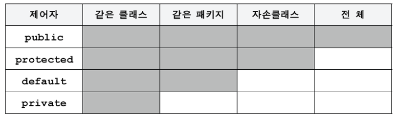

- 클래스패스(Classpath)

  클래스패스(Classpath)는 자바 애플리케이션에서 사용되는 자바 클래스들의 위치를 지정하는 환경 변수입니다. 클래스패스는 자바 가상 머신(JVM)에서 애플리케이션을 실행하는 데 필요한 클래스를 찾기 위해 사용됩니다.

  클래스패스는 여러 가지 방법으로 설정할 수 있습니다. 환경 변수로 설정하거나 자바 애플리케이션을 실행할 때 명령 줄에서 설정하거나 코드에서 프로그래밍적으로 설정할 수 있습니다.

  클래스패스를 환경 변수로 설정하려면 터미널에서 다음 명령을 사용할 수 있습니다.

    ```
    export CLASSPATH=/path/to/classes
    ```

  자바 애플리케이션을 실행할 때 명령 줄에서 클래스패스를 설정하려면 다음 명령을 사용할 수 있습니다.

    ```
    java -classpath /path/to/classes MyClass
    ```

  여기서 `MyClass`는 메인 클래스의 이름입니다.

  코드에서 클래스패스를 프로그래밍적으로 설정하려면 `System.setProperty()` 메소드를 사용할 수 있습니다.

    ```java
    System.setProperty("java.class.path", "/path/to/classes");
    ```

  자바 애플리케이션이 필요한 클래스를 찾고 오류 없이 실행되도록 클래스패스를 올바르게 설정하는 것이 중요합니다.

- import 문

  자바에서는 자동으로 import되는 패키지가 있습니다. 그 중 하나가 `java.lang` 패키지입니다. `java.lang` 패키지에 포함된 모든 것은 자유롭게 사용할 수 있습니다. 또한, 현재 같은 패키지에 속한 클래스들은 따로 import 해주지 않아도 됩니다.

  그 외 자바 파일에서 다른 패키지의 클래스를 사용하기 위해서는 `import` 문을 사용해 해당 클래스를 참조해야 합니다. `import` 문을 사용하지 않고 클래스를 사용하려면 클래스의 전체 경로를 사용해야 하는데, 이는 코드를 길고 복잡하게 만들 수 있습니다.

  다음은 `java.util` 패키지에서 `ArrayList` 클래스를 사용하는 예시입니다.

    ```java
    import java.util.ArrayList;
    
    public class MyClass {
        public static void main(String[] args) {
            ArrayList<String> list = new ArrayList<>();
            list.add("Hello");
            list.add("World");
            System.out.println(list);
        }
    }
    ```

  `import java.util.ArrayList` 문을 사용하여 `ArrayList` 클래스를 참조하고 있습니다. 이제 `ArrayList` 클래스를 사용할 때 `java.util.`을 붙일 필요가 없습니다.

  자바에서 `import` 문을 사용하여 다른 패키지에 속한 클래스를 참조할 수 있습니다. `import` 문은 소스 코드의 맨 위에 선언되어야 합니다. `import` 문의 구문은 다음과 같습니다.

    ```java
    import packageName.className;
    ```

  여기서 `packageName`은 참조할 클래스가 속한 패키지의 이름이고, `className`은 참조할 클래스의 이름입니다. 예를 들어 `java.util` 패키지에서 `ArrayList` 클래스를 참조하려면 다음과 같이 작성할 수 있습니다.

    ```java
    import java.util.ArrayList;
    ```

  만약 패키지 내의 모든 클래스를 참조하려면 와일드카드(`*`)를 사용할 수 있습니다.

    ```java
    import packageName.*;
    ```

  위의 문장에서 `packageName`은 참조할 패키지의 이름입니다. 이제 `packageName` 내의 모든 클래스를 참조할 수 있습니다. 하지만 이 방법은 코드를 이해하기 어렵게 만들 수 있으므로 권장되지 않습니다.

- 제어자(Modifier)

  자바에서 제어자(Modifier)란 클래스, 변수, 메소드, 생성자 등의 멤버에 부가적인 의미를 부여할 때 사용하는 키워드입니다.

  제어자는 크게 두 가지로 나뉩니다. 하나는 접근 제어자(Access Modifier)이고, 또 하나는 그 외 제어자입니다.

  접근 제어자는 클래스, 변수, 메소드, 생성자 등의 멤버에 대한 접근을 제어합니다. 자바에서는 총 4가지의 접근 제어자가 있습니다.

  - `public`: 모든 패키지에서 접근 가능합니다. class선언에서 사용가능
  - `protected`: 같은 패키지와 상속 관계에 있는 클래스에서 접근 가능합니다. class선언에서 사용불가🔥
  - `default`(생략 가능): 같은 패키지 내에서만 접근 가능합니다. class선언에서 사용가능
  - `private`: 같은 클래스 내에서만 접근 가능합니다. class선언에서 사용불가🔥

    

    그 외 제어자는 다음과 같습니다.
    
    - `static` 키워드는 자바에서 클래스 멤버임을 나타내는 데 사용됩니다. 즉, 클래스에서 생성된 모든 객체의 공통적인 속성이나 메소드를 표시하는 데 사용됩니다. `static` 멤버는 클래스의 모든 인스턴스에서 공유되며, 클래스의 인스턴스를 생성하지 않고도 액세스할 수 있습니다. 클래스의 인스턴스 수를 추적하거나 특정 리소스(예: 데이터베이스 연결)의 하나의 인스턴스만 생성하고 클래스의 모든 인스턴스에서 공유하려는 경우 등 다양한 상황에서 유용합니다. 멤버 변수 또는 메소드를 `static`으로 표시하여 클래스의 모든 인스턴스에서 사용할 수 있습니다. 또한 클래스 이름에서 직접 액세스할 수 있습니다.
        
        
        
    - `final` 키워드는 수정될 수 없음을 표시하는 데 사용됩니다. 이는 프로그래밍 언어에서 예기치 않은 변경으로 인해 발생할 수 있는 오류나 다른 문제를 방지하는 데 도움이 됩니다. 이는 상수를 선언하거나 객체 지향 프로그래밍에서 하위 클래스 또는 메소드 오버라이딩을 방지하는 데 사용될 수 있습니다. `final` 키워드를 전략적으로 사용함으로써 개발자는 더 견고하고 오류가 없는 코드를 작성하여 시간이 지나도 유지보수하기 쉬운 코드를 작성할 수 있습니다.
        
        
        
    - `abstract`: 추상 클래스나 추상 메소드를 표시합니다.
    - `synchronized`: 스레드 동기화를 위해 사용됩니다. ex) 영화, 기차 등 발권 예매 시스템에 사용⭐️
    - `transient`: 직렬화를 위해 사용됩니다. ⭐️
    - `native`: 제어자는 자바 코드에서 네이티브 코드(다른 언어로 작성된 코드)와 상호작용하기 위해 사용됩니다. native 메소드는 자바 코드에서 구현되지 않고, 네이티브 코드로 작성됩니다. ⭐️
    - `volatile`: 스레드 간 변수의 값 동기화를 위해 사용됩니다.
    - `strictfp`: 는 제어자(modifier) 중 하나로, 부동소수점 연산의 결과를 IEEE 754 규격에 따라 반올림하여 표준화합니다. 이는 다른 플랫폼에서도 동일한 결과를 보장하며, 이식성(포팅성)이 높은 코드를 작성할 때 유용합니다.
    
    제어자는 각각의 멤버에 대해 부가적인 의미를 부여하기 때문에, 자바 프로그래밍에서 중요한 역할을 합니다. 적절하게 사용한다면 좀 더 안전하고 유지보수가 용이한 코드를 작성할 수 있습니다.


<aside>
👉 정보은닉(Information Hiding)은 객체지향 프로그래밍에서 중요한 개념 중 하나입니다. 정보은닉은 객체의 내부 상태를 외부에서 직접 접근하지 못하도록 보호하는 것을 의미합니다. 이를 통해 객체의 내부 구현을 숨기고, 객체 간의 결합도를 낮출 수 있습니다.

자바에서는 정보은닉을 위해 접근제어자(Access Modifier)를 제공합니다. 접근제어자는 클래스의 멤버(필드, 메소드 등)에 대한 접근을 제한하는 역할을 합니다.

자바에서는 다음과 같은 네 가지의 접근제어자를 제공합니다.

- `public`: 모든 클래스에서 접근 가능합니다.
- `protected`: 같은 패키지나 상속받은 클래스에서 접근 가능합니다.
- `default`(생략 가능): 같은 패키지 내에서만 접근 가능합니다.
- `private`: 같은 클래스에서만 접근 가능합니다.

객체의 내부 상태를 외부로부터 보호하려면, 멤버 변수를 `private`로 선언하고, 이를 접근하는 메소드(getter, setter)를 `public`으로 선언하는 것이 일반적입니다. 이를 통해 객체의 내부 상태를 보호하면서도 외부에서 필요한 정보를 제공할 수 있습니다.

```java
public class Person {
    private String name;
    private int age;

    public String getName() {
        return name;
    }

    public void setName(String name) {
        this.name = name;
    }

    public int getAge() {
        return age;
    }

    public void setAge(int age) {
        this.age = age;
    }
}
```

위 코드에서 `name`과 `age` 멤버 변수는 `private`으로 선언되어 있습니다. 이들 멤버 변수를 접근하는 메소드인 `getName()`, `setName()`, `getAge()`, `setAge()`는 `public`으로 선언되어 있습니다. 따라서 `Person` 클래스의 외부에서는 멤버 변수에 직접 접근할 수 없으며, 메소드를 통해 객체의 내부 상태에 대한 접근 제어가 가능합니다.

</aside>